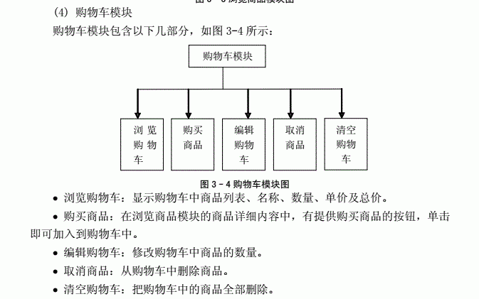
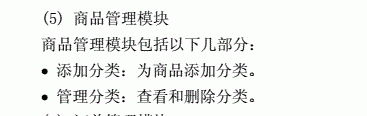
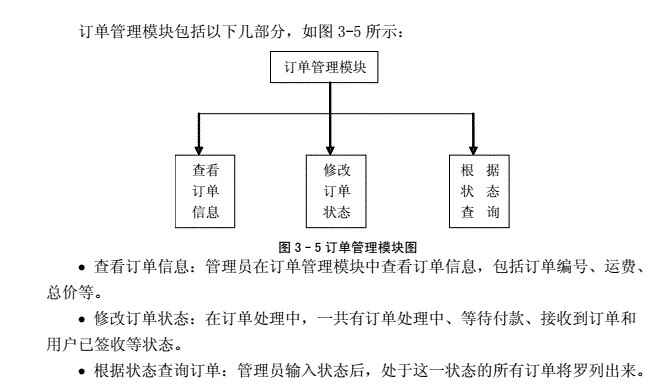

# 总体设计

由系统的总体任务可以归纳出以下系统的功能。

就用户行为而言，校园二手交易系统应该有用户注册和登录功能。用户进入系统应该有浏览商品的功能。用户需要快速方便的找到自己想要的商品，就需要提供一个搜索功能。在交易系统的首页，需要提供给用户公告展示、商品展示和促销推荐商品的功能。为了体现交互性和人性化，应该有用户评论商品的功能。同时，电子商务最主要的功能就是购物车功能，提供给用户购物。
就管理员行为而言，管理员需要对系统的用户进行管理。管理员需要发布公告信息，所以要有公告管理功能。管理员要处理用户所下的订单，即需要订单管理功能。同时，管理员还要对商品进行分类，以及添加分类信息，所以要有商品管理的功能。

## 模块设计

用户购买之前可以相互交流（聊天记录cookie保存，后端不做保存）

个别模块的具体功能如下：

### 用户模块

个人信息：昵称 性别 生日 头像  登录密码 支付密码 手机号 邮箱 密保

我的尺码   角色   姓名 性别 生日 身高 体重 身材 （肩宽 胸围 腰围 臀围 裤长 ）鞋靴 内衣（上胸围 下胸围）

收货地址 邮件订阅

### 查询模块

输入查询关键字，并选择查询方式，即可查询（大类小类即可 其余在命名时引导）

### 浏览商品

ps：推荐商品为广告位，主页推流显示的商品，点击后可以进入商品详情界面

### 购物车模块

注：数量不能超过商品已有数量。

### 类别管理

### 订单管理模块

