# 详细设计

## E-R图

用户

性别 boolean

邮箱绑定校验

头像存储方式url

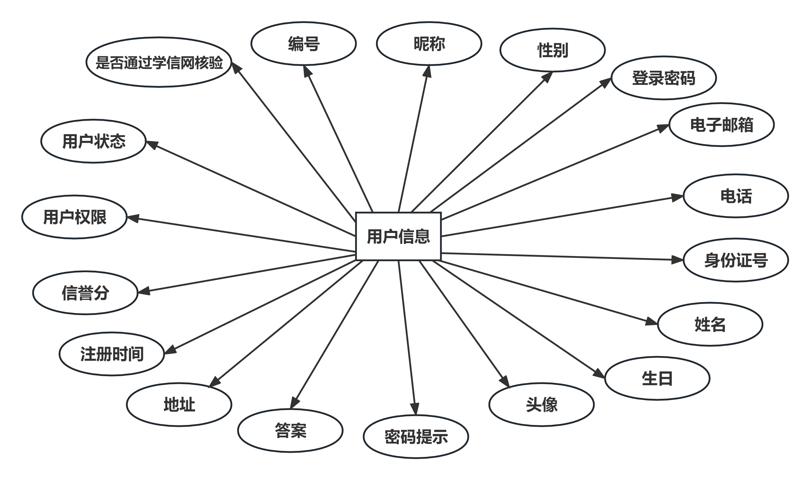

地址(稍微修改一下，建立省市区三表)

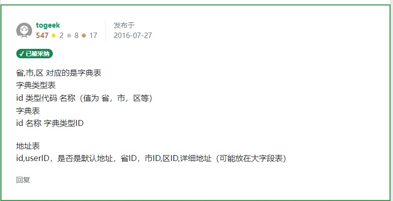

角色

姓名 性别 生日 身高 体重 身材 （肩宽 胸围 腰围 臀围 裤长 ）鞋靴 内衣（上胸围 下胸围）

商品

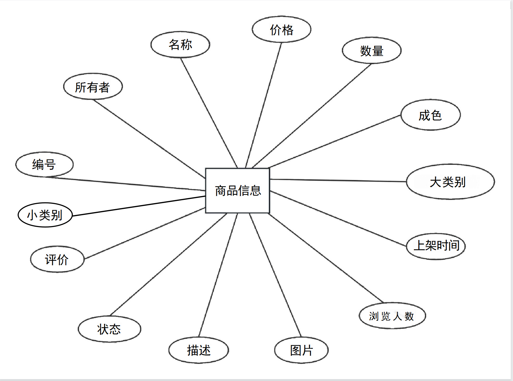

订单

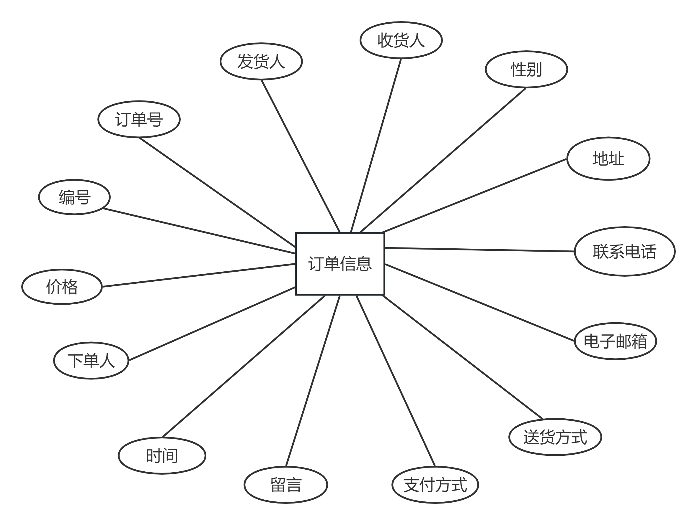

公告

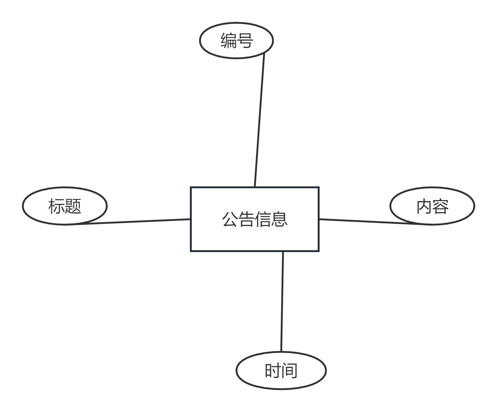

竞价

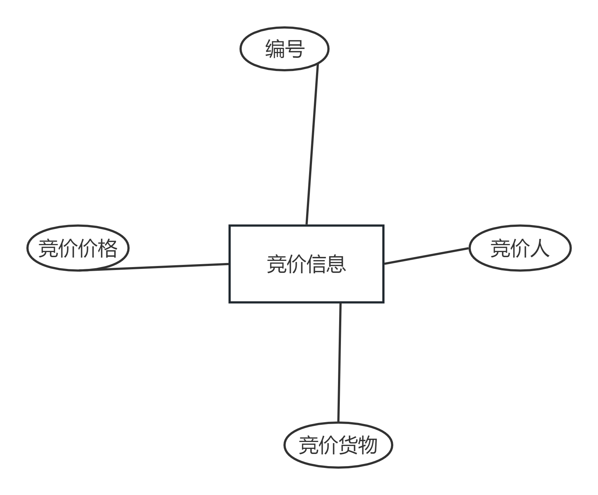

评价

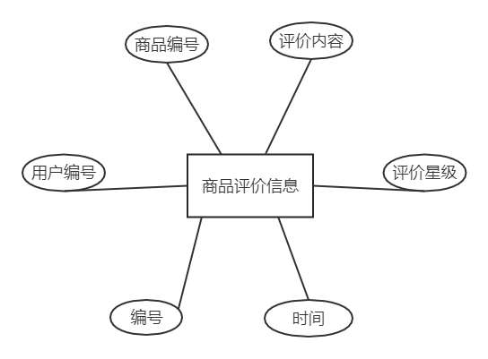

### 用户

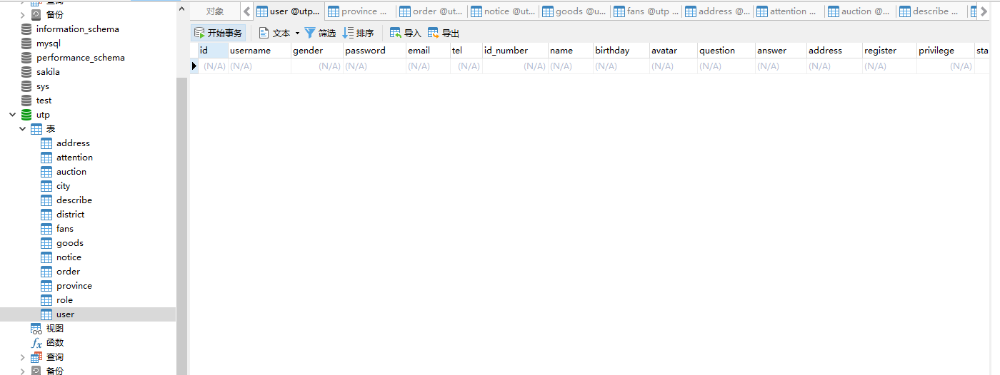

### 货物

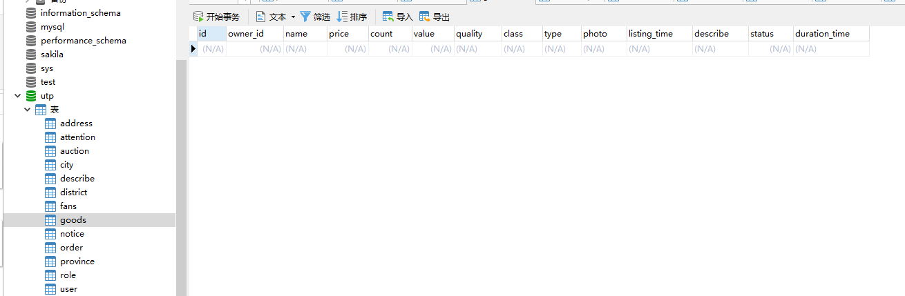

### 评价

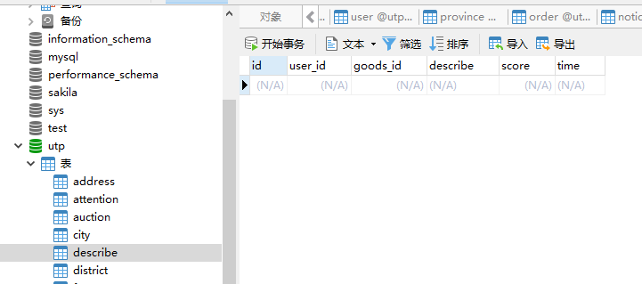

### 公告

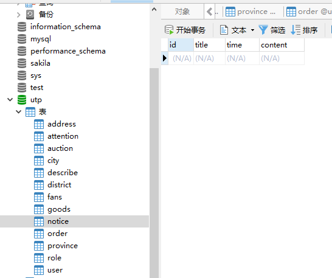

### 竞拍

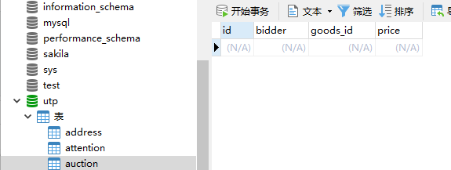

### 订单

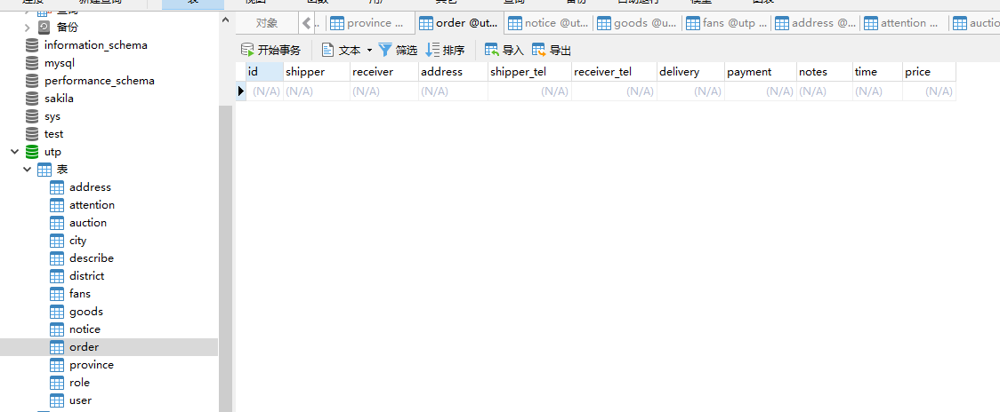

### 地址

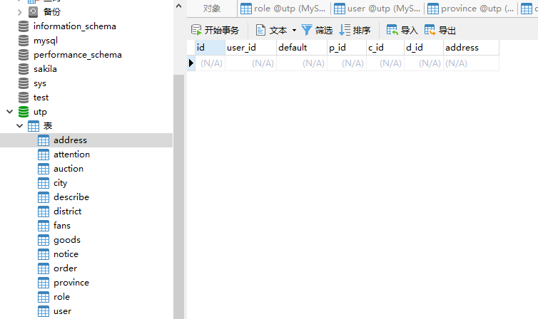